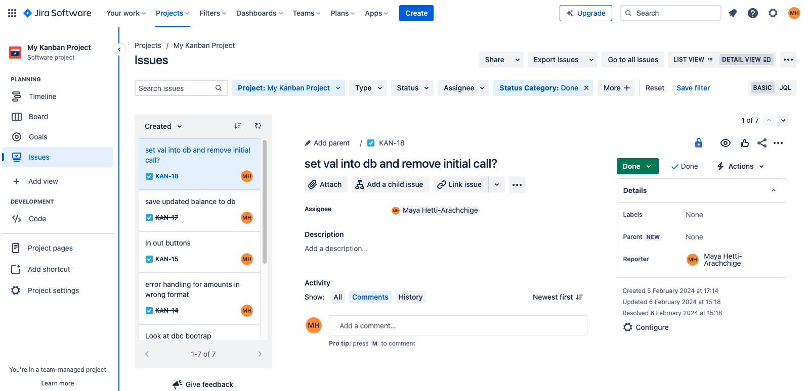

**Dash Student Finance Tracker**

**RESEARCH**

**Background information**

Financial literacy is often quite low among students and this leads to difficulty
when trying to manage student finances and budgeting. Studies have even shown that improved money
management can reduce stress and lead to better financial futures which tends to provide a better quality of life. 

**Problem statement**

The problem mentioned above inspired me to develop an app that allows students to keep track of their expenses and view stats such as which payment 
method is being used the most and what category of spending is most prevalent so that they can highlight where they can minimise expenses and save more.

**Objectives:**
- Develop an app that allows students to easily track expenses 
- Allow students to view various statistics e.g. what category is taking lots of 'hidden expenses'
- Enhance financial literacy of students 
 
**Language and frameworks**

I developed my app using Python along with the dash web framework. In short - Dash is a web framework  primarily used to develop web applications. I felt this would be a great opportunity to test its capabilities to set up a financial tracker as it requires little to no CSS and is fully Python based. This makes it a great tool to use alongside the Object Orientated Programming (OOP)
paradigm as you can separate the different components of the application using the model view controller (MVC) structure and pull methods from the Model class(business logic) and View class(UI) into the controller when creating your callbacks. Please note - callbacks are what make components such as toggles and graphs in your UI interactive. 

**ANALYSIS** 

**Data storage**

From the beginning stages, it was obvious that a system for saving data was going to be required, to hold the transactions 
from previous sessions and the balance value. For this purpose, I used Python's 'sqlite3' library and put together an entity relationship model as such:
[UPDATE]: Decided to hard code temporary login credentials whilst exploring ways of encrypting passwords to maintain user integrity.

**Model View Controller (MVC)**

I decided to use the model view controller to organise my code. This keeps the UI, data handing and interactions between the two separate. This proved to be 
view useful when locating the source of bugs  and errors and matched well with the nature of the dash framwork. File structuring was kept as such:

**Flowchart**

The flowchart above provides a general depiction of the workings of the app and how data is pulled from the database to form the dashboard page and how the dash app interacts with user input.

**Workflow**

I decided to use the jira board system by Atlassian to manage my tasks - this was very useful to keep track of little changes I was 
hoping to make once I had developed the bulk of the app and wanted to take a bit of time to refine a few features and make them more robust.
Provided below is a screenshot of the task manager I used:

**IMPLEMENTATION**

Here I will dicuss features I used to develop my application:

OOP

OOP composition was major to keeping my code organised as I maintained the Model and View class of which instances were created and used in the controller file (Controller.py).
below are a breakdown of the classes created:

I also used composition and inheritance for the Card base class that created to have the default styling pre-set and reduce duplicate code:

This is an example of how I used this card to reduce duplicate code in my project:

As you can see I only need to create an instance of the card and then set the card content.

DATABASES 

Databases laid the foundations for collecting, saving and rendering grids with data loaded from previous sessions of the application running
The process of setting up the database system involved:

a. creating tables

b. updating tables

c. connecting sql functions to callbacks

CALLBACKS

Callbacks form the backbone of dash apps. They are what allows components such as tables, buttons and toggles
to be interactive. An example of where I used these was in the login page:

There are two fields for the username and password respectively. Then we have the trigger which is the 'Login' button. Now let's
break down the code behind it:

We need to clarify three things:
- the Input 
- the Output 
- the State

The input is what triggers the function 'login_auth' under the callback, the Ouput is the type
of object you want to return. In this case we want to return an url (to the dashboard page) and a message that we add
to a container below that can show whether the login was successful. Then if we look at the 'login_auth' function we check if the login details 
match the currently hard coded ones and the return the url of the dashboard if they match or no update if not.

When we provide that url, we trigger another callback:

This checks the url and provides layouts that are rendered depending on the URL.

REFACTORING

Refactoring became an integral part of keeping the project under a manageable size as we call for the data 
in the databases quite a few times so, I removed all the repetitive code that kept connecting to the db just to
return what was in there without any modifications into one singular function in the Model class, which can easily be
accessed.

As you can see this function is reused up to 5 times throughout the project which has dramatically reduced the volume of 
repetitive code

I have also started putting together a config class as to have a central place for things such as categories and payment methods
that can be viewed from the dropdown in the dashboard:

This has helped majorly in getting cleaner code as shown in the before and after code below:

**Before:**

**After:**

For reference this is a snippet of the config file which is a work in progress:

BUDGET TRACKING 

I added a budgets card that allows students to see a visual represention of their spending in three very basic 
categories. The budgets figures are preset to 50% for needs, 30% for school and 20% for fun.

I also stuck to my goal of adding some form of financial education to my app, which can be found on the budgets page as well
and I again used the card class I had previously created to reduce duplicate code.

Please note: for the meanwhile, this has been hardcode, but I plan to have a database table where a quote can be published everyday and picked up by the card
maker based on a date key:

TESTING 

I wanted to ensure my application was very robust and one of the areas I needed
to cover was user input. We take user input when passing in transactions in the dashboard, so to tackle
this I put together some test data:

I wanted to ensure that if the inputs were erroneous, they were not saved and that the user
is notified that the data isn't going to be accepted by using warning dialogs as such:

REVIEW

In conclusion: despite having achieved my objectives with this projects, I have definitely
found room for improvement. To be frank:

**Designed and Implemented Security**

I believe this is where we fell short in terms of providing a very secure way of saving data into the databases. There are certain values that 
I had hoped to put into a db such as the login details and due to time contraints I wasn't able to focus on researching encryption methods and I felt it was necessary to encrypt the
transactions data to. Perhaps more planning in the beginning stages surrounding authentication would have been beneficial.

**Approach to design and development**

I am happy that I chose to embark on this project using Python and the dash framework as they both worked well hand in hand with object
orientated programming. The development process did at times seem overwhelming as I hadn't anticipated some of features I had eventually added such as the AG grids that show stats such as 
most prevalent spending method and going back into the code to refactor turned out to be a finicky but rewarding process. The refactoring had to be done quite carefully
as the different files sometimes have dependencies. I also added the config file towards the later stages of development as it added an almost central point where you can configure certain values
with ease without having to scan through lines and lines of code to find where the categories for the transaction dropdown are being set for 
example 

Further development/improvements Review.
I do feel there are a few things I can improve:
1. Ability to configure the budget values in the budgets page so that the user can decide how much they want to put towards school, needs and fun
2. Ability to delete transactions if they have entered the wrong valur or want to change their description for e.g.
3. Save daily quotes into a table with a key that holds the date and a value that holds the quote so that the card can pull the daily quote from that table in a db 
4. More specific error messages when saving transactions because for now they are pretty generic

Self-reflection and review on skills, experience and insights utilised and improved.

I am very glad to have worked on this project as the Dash framework is something pretty new as a programmer as I feel it is such an efficient ways 
to build web applications that are fully Python based but that can be further modified with CSS files or clientside callbacks to inject JS. I felt this was 
also a perfect opportunity to work more with the pandas library and develop my understanding of OOP programming. All in all, a very fulfilling project.

